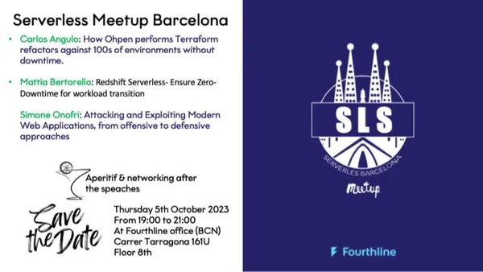

# 202310-bcn-serverless-meetup-tf-refactor

* Talk: How Ohpen performs Terraform refactors against hundreds of environments without affecting resources nor having downtimes
* Event: [Serverless Barcelona Meetup & AWS User Group](https://www.meetup.com/serverless-barcelona/events/295976385/)
* Meetup Group: [Serverless Barcelona](https://www.meetup.com/serverless-barcelona/)
* Date: 202310
* 📺️ slides created using MARP and vs code:
  * [slides](slides.md)
  * https://marp.app
  * [vs code extension](https://marketplace.visualstudio.com/items?itemName=marp-team.marp-vscode)

