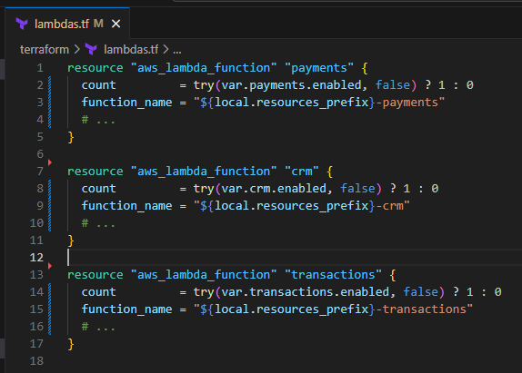
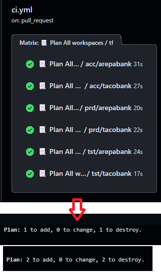
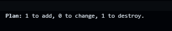
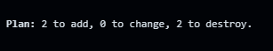
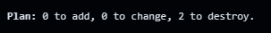
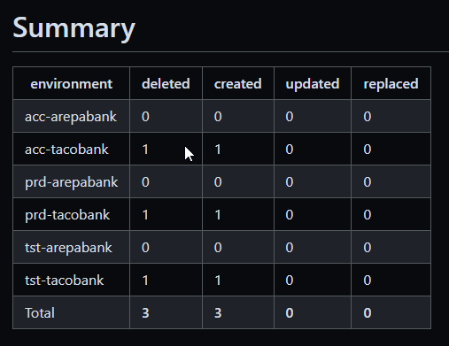

<!--
_class: invert
-->

# **Refactoring hundred of environments with terraform**

1. **About me**
2. **Goal**
3. **Problem**
4. **What do we need?**
5. **Our solution**
6. **Questions**

---

# **About me**

- I am Carlos Angulo
- I work at [Ohpen](https://www.ohpen.com)
- I have more than 7 years of experience. Last years as a Platform Engineer
- You can follow me on LinkedIn or GitHub(cangulo)

---

# **Goal**

We want to refactor and simplify a terraform solution. _How would you tackle this ? 🤔_

**demo time🧑‍💻**

<!-- TODO: add screenshot of terraform code -->

---

# **Problem**

* We edit the code and we perform a terraform plan to ensure our changes do what we expect. 📜
* If we have 3 environments, we check 3 terraform plans. But, what if we have hundreds of environments? 💯

---

# **What do we need?**

* We need to aggregate all the environments changes so it is easy for us to know how our changes affect them.

---

# **Our solution**

- We end up creating a open source GH action for it:
  - [terraform-plan-summarize-gh-action](https://github.com/ohpensource/terraform-plan-summarize-gh-action)

---

# **Questions?**

